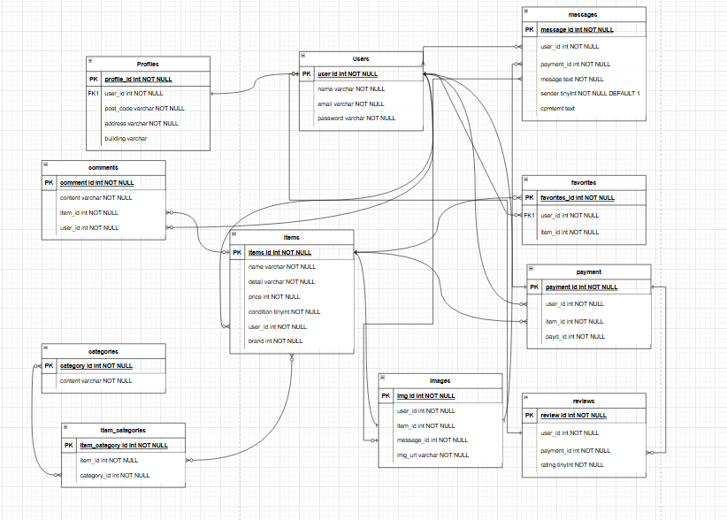

# Coachtech フリマアプリ

## 概要説明（どんなアプリか）
本アプリケーションは、フリマアプリです。
ユーザーは商品を出品・購入でき、購入後は出品者とコメントを交わしたり、取引完了後に評価を残すことができます。


---

## アプリケーション URL
- 開発環境：http://localhost/
- phpMyAdmin：http://localhost:8080/

---

## テスト用アカウント

1. テストユーザー1
   - name: TestUser1
   - Email: test1@example.com
   - Password: password

2. テストユーザー2
   - name: TestUser2
   - Email: test2@example.com
   - Password: password

2. テストユーザー3
   - name: TestUser3
   - Email: test3@example.com
   - Password: password

> テスト用アカウントの内容変更は、`src/database/seeders/UserTableSeeder.php` ファイルを適宜編集してください。

---

## 機能一覧

- 会員登録
- ログイン / ログアウト
- 商品一覧取得
- 商品詳細取得
- 商品出品
- 商品購入
- 購入後の取引チャット
- 取引完了処理・評価
- お気に入り追加 / 削除
- ユーザーマイページ表示
- ユーザー情報編集

---

## 使用技術（実行環境）

- PHP 8.4.2
- Laravel 8.83.29
- Docker 27.3.1
- MySQL 9.0.1
- Node.js 18.20.6
- Stripe
- JavaScript 18.20.6

---

## ER図


---

## 環境構築

### Dockerビルド
1. `git clone git@github.com:snowrain-lazuli/coachtech-free-market.git`
2. DockerDesktopアプリを立ち上げる
3. `docker-compose up -d --build`

> *MacのM1・M2チップのPCの場合、`no matching manifest for linux/arm64/v8 in the manifest list entries`のメッセージが表示されビルドができないことがあります。  
> エラーが発生する場合は、docker-compose.ymlファイルの「mysql」内に「platform」の項目を追加してください*
```yaml
mysql:
    platform: linux/x86_64 # この行を追加
    image: mysql:9.0.1
    environment:

```

**Laravel環境構築**
1. `docker-compose exec php bash`
2. `composer install`
3. 「.env.example」ファイルを 「.env」ファイルに命名を変更。または、新しく.envファイルを作成
4. .envに以下の環境変数を追加
``` text
DB_CONNECTION=mysql
DB_HOST=mysql
DB_PORT=3306
DB_DATABASE=laravel_db
DB_USERNAME=laravel_user
DB_PASSWORD=laravel_pass

STRIPE_KEY=
STRIPE_SECRET=
```

5. アプリケーションキーの作成
``` bash
php artisan key:generate
```

6. 管理用のStripeの作成・ログイン
- ログインURL：https://dashboard.stripe.com/login
- 登録URL：https://dashboard.stripe.com/register

7. APIキーの確認
- 確認用URL：https://dashboard.stripe.com/test/apikeys
- 公開可能キーを4で記載したSTRIPE_KEY=に記載する
- シークレットキーを4で記載したSTRIPE_SECRET=に記載する

8. マイグレーションの実行
``` bash
php artisan migrate
```

9. シーディングの実行
``` bash
php artisan db:seed
```
